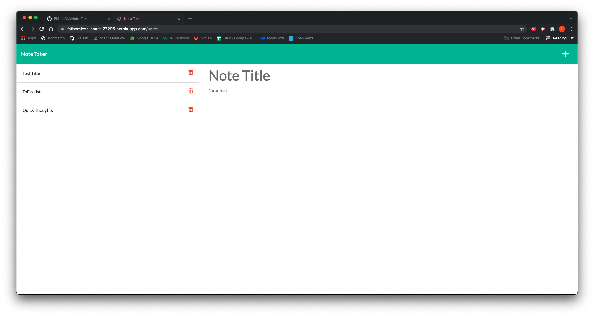

# Note Taker
  

  ## Description
  An app that provides users with the ability to write, save and delete notes. This allows users to organize their thoughts and keep track of tasks they need to complete.
  ## Table of Contents
  * [Installation](#installation)
  * [Usage](#usage)
  * [License](#license)
  * [Questions](#questions)

  ## Installation
  Navigate to https://fathomless-coast-77295.herokuapp.com/ in order to use the app. 
  ## Usage
    - Users can click the add button to create a new note.
    - Users can then type the title of their note as well as the content. Both are required.
    - Once a title and text are added, a save button will appear allowing the user to save their note.
    - If a note is no longer needed, the user can click the trash can icon next to the note to delete it.

  
  ## License     
    MIT License

    Copyright (c) 2021 Eric Martin

    Permission is hereby granted, free of charge, to any person obtaining a copy
    of this software and associated documentation files (the "Software"), to deal
    in the Software without restriction, including without limitation the rights
    to use, copy, modify, merge, publish, distribute, sublicense, and/or sell
    copies of the Software, and to permit persons to whom the Software is
    furnished to do so, subject to the following conditions:

    The above copyright notice and this permission notice shall be included in all
    copies or substantial portions of the Software.

    THE SOFTWARE IS PROVIDED "AS IS", WITHOUT WARRANTY OF ANY KIND, EXPRESS OR
    IMPLIED, INCLUDING BUT NOT LIMITED TO THE WARRANTIES OF MERCHANTABILITY,
    FITNESS FOR A PARTICULAR PURPOSE AND NONINFRINGEMENT. IN NO EVENT SHALL THE
    AUTHORS OR COPYRIGHT HOLDERS BE LIABLE FOR ANY CLAIM, DAMAGES OR OTHER
    LIABILITY, WHETHER IN AN ACTION OF CONTRACT, TORT OR OTHERWISE, ARISING FROM,
    OUT OF OR IN CONNECTION WITH THE SOFTWARE OR THE USE OR OTHER DEALINGS IN THE
    SOFTWARE.  

  ## Questions
  If you would like to connect with the developer about Note Taker, please email them at eric_martin@me.com or their gitHub at [@EMtheDM](https://github.com/EMtheDM).
